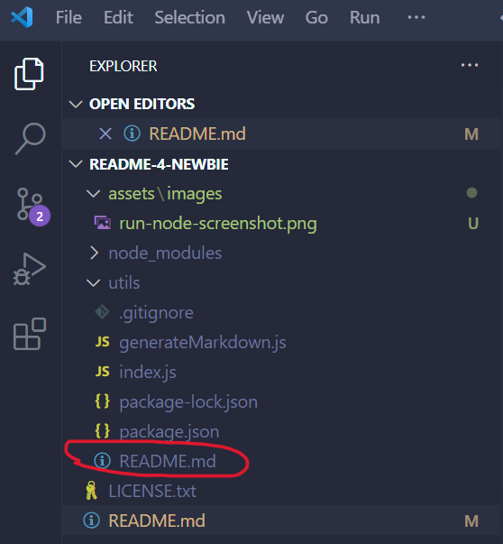

# README-4-Newbie (Module 9 Challenge)

## Description

When creating an open source project on GitHub, it’s important to have a high-quality README for the app. This should include what the app is for, how to use the app, how to install it, how to report issues, and how to make contributions. 

You can quickly and easily generate a README file by using a command-line application to generate one. This allows the project creator to devote more time working on the project. So that is what we are going to do here!

The task is to create a command-line application that dynamically generates a professional README.md file from a user's input using the [Inquirer package](https://www.npmjs.com/package/inquirer/v/8.2.4).


## Table of Contents

- [Description](#description)
- [Installation](#installation)
- [Usage](#usage)
- [Test Sample](#test-sample)
- [Credits](#credits)
- [Contributing](#contributing)
- [License](#license)

## Installation

First, you will want to make sure that your repo includes a package.json with the required dependencies. You can create one by running `npm init` when you first set up the project, before installing any dependencies.

Then, you will install `inquirer` by entering `npm i inquirer@8.2.4` in your terminal.

Once installed, the application will be invoked by using the following command:

`node index.js`

## Usage

Here are some helpful tips from [The Full-Stack Blog](https://coding-boot-camp.github.io/full-stack/github/professional-readme-guide) on how to create a professional README :

A high-quality README file explains what your application does and why you used the technologies that you did. At a bare minimum, a README needs a title and a short description explaining the what, why, and how of the project.

Use the following questions as a guide:

What was your motivation?
Why did you build this project?
What problem does it solve?
What did you learn?
What makes your project stand out?
Your README might also describe some of the challenges you faced, as well as the features you plan to implement in the future. And if your project is deployed, make sure to include a link to the deployed application so people can see it in action!

README files are written in Markdown, and are always named README.md (note that README is in all caps). If you're new to Markdown, refer to the [GitHub guide on mastering markdown](https://docs.github.com/en/get-started/writing-on-github/getting-started-with-writing-and-formatting-on-github/basic-writing-and-formatting-syntax) or search the internet for Markdown tutorials.

Including a 'User Story' and 'Acceptance Criteria are optional. As long as you have a clear, precise Description, the user should know what the end goal is of your application. However, if you choose to include the user story and acceptance criteria sections, these are examples of both:

User Story:

``````
AS A developer
I WANT a README generator
SO THAT I can quickly create a professional README for a new project
``````

Acceptance Criteria:

``````
GIVEN a command-line application that accepts user input
WHEN I am prompted for information about my application repository
THEN a high-quality, professional README.md is generated with the title of my project and sections entitled Description, Table of Contents, Installation, Usage, License, Contributing, Tests, and Questions
WHEN I enter my project title
THEN this is displayed as the title of the README
WHEN I enter a description, installation instructions, usage information, contribution guidelines, and test instructions
THEN this information is added to the sections of the README entitled Description, Installation, Usage, Contributing, and Tests
WHEN I choose a license for my application from a list of options
THEN a badge for that license is added near the top of the README and a notice is added to the section of the README entitled License that explains which license the application is covered under
WHEN I enter my GitHub username
THEN this is added to the section of the README entitled Questions, with a link to my GitHub profile
WHEN I enter my email address
THEN this is added to the section of the README entitled Questions, with instructions on how to reach me with additional questions
WHEN I click on the links in the Table of Contents
THEN I am taken to the corresponding section of the README
``````
In this section, you can also provide instructions and examples for use. Include screenshots as needed.

To add a screenshot, create an `assets/images` folder in your repository and upload your screenshot to it. Then, using the relative filepath, add it to your README using the following syntax:

    ```md
    
    ```

Preview:



If you want to include an image but adjust it's size, use the following syntax instead:

    ```
    
    ```
Preview:


Include any other screenshots you deem necessary to help someone who has never been introduced to your application understand the purpose and function of it. This is how you will communicate to potential employers or other developers in the future what you built and why, and to show how it works.


## Test Sample

Go the extra mile and write tests for your application. Then provide examples on how to run them here.

For example:

## Credits

List your collaborators, if any, with links to their GitHub profiles.

If you used any third-party assets that require attribution, list the creators with links to their primary web presence in this section.

If you followed tutorials, include links to those here as well.

For example:

[Coding Boot Camp GitHub Page](https://github.com/coding-boot-camp)

[Professional README Guide](https://coding-boot-camp.github.io/full-stack/github/professional-readme-guide)

[README Markdown Guide](https://docs.github.com/en/get-started/writing-on-github/getting-started-with-writing-and-formatting-on-github/basic-writing-and-formatting-syntax)

## Contributing

If you created an application or package and would like other developers to contribute it, you can include guidelines for how to do so. The [Contributor Covenant](https://www.contributor-covenant.org/) is an industry standard, but you can always write your own if you'd prefer.

## License

Copyright (c) Microsoft Corporation. All rights reserved.

Licensed under the [MIT](LICENSE.txt) license.